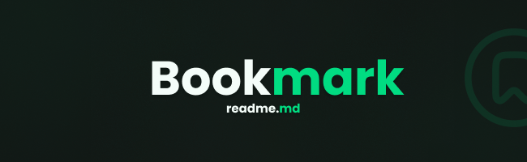

# Bookmark - Biblioteca conectada!

<!-- ## Guia
<a href="#projeto-Bookmark"> 🔷 Descrição do projeto; </a>

<a href="./doc.md"> 🔷 Documento de requisitos; </a>

<a href="./quickstart.md"> 🔷 Como rodar o projeto. </a> -->

## Projeto "Bookmark"

O projeto "Bookmark" tem como objetivo a modernização e automação de processos manuais e arcaicos no sistema de empréstimo de livros da Escola Estadual Prof. Silvio Oliveira dos Santos. Com um foco na redução de custos, buscamos facilitar e modernizar o processo de empréstimo, oferecendo uma solução eficiente e acessível tanto para estudantes quanto para funcionários da escola.

Esse projeto, planejado por Guilherme Freitas, estudante do 2º ano do ensino médio, visa não apenas aprimorar a gestão da biblioteca, mas também promover uma cultura de leitura mais acessível e dinâmica dentro da comunidade escolar.
##

### Licença

The MIT License (MIT)

Copyright ©️ 2024 - BookMark
